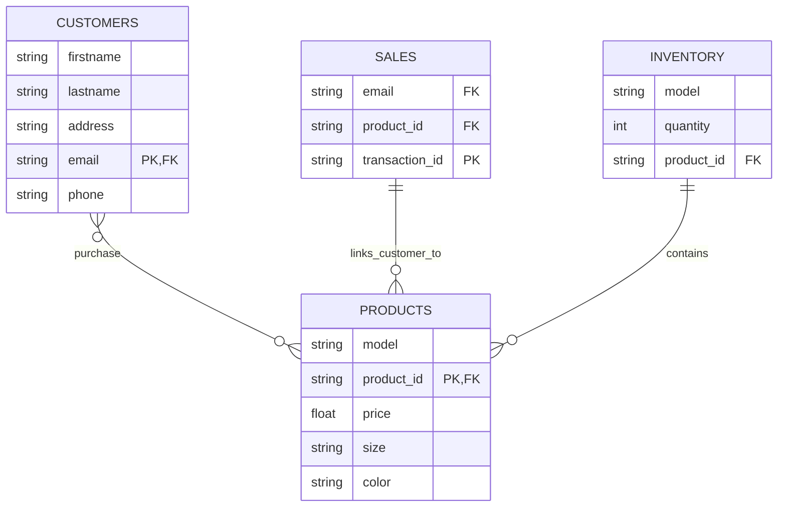

### Description
* The entities in this ERD are: PRODUCTS, CUSTOMERS, SALES, AND INVENTORY
* PRODUCTS:
  * The PRODUCTS entity represents the different models of shoes sold in the store
  * The attributes are **shoe model**, **product_id**, **price**, **size**, and **color**.
  * The **product_id** is a _primary key (PK)_ within the PRODUCTS entity, and is also a _foreign key (FK)_ that is referenced within the SALES and INVENTORY entity.  It is a unique identifier for each product within the store inventory
* CUSTOMERS:
  * The CUSTOMERS entity represents the information about the customers that purchase shoes
  * The attributes are **firstname**, **lastname**, **address**, **email**, and **phone**
  * **Email** is a _primary key (PK)_ within the CUSTOMERS entity and is also a _foreign key (FK)_ that is referenced within the SALES entity.
* SALES:
  * The SALES entity represents the transactions that link the customer to a purchased product
  * The attributes are **email**, **product_id**, and **transaction_id**
  * **Email** is a _foreign key (FK)_ that is referenced within the CUSTOMER entity
  * **Product_id** is a _foreign key (FK)_ that is referenced within the CUSTOMER and PRODUCTS entity.  It is a unique identifier for each product within the store inventory
  * **Transaction_id** is a _primary key (PK)_ that represents a unique transaction for each sale
* INVENTORY:
  * The INVENTORY entity represents the stock levels of different shoe models
  * The attributes are **model**, **quantity**, and **product_id**
  * **Product_id** is a _foreign key_ that is referenced within the SALES and PRODUCTS entity.  It is a unique identifier for each product within the store inventory

### Significance
Inventory contains products, therefore to track the quantity and availability of inventory, each product is assigned a unique identifier.  This identifier, product_id, allows the store to keep an adequate count of different shoe models, sizes, and colors.   

Customers purchase products and the sales entity links the customer to the purchase.  The transaction_id represents the unique transaction, while the email links to each unique customer.  

